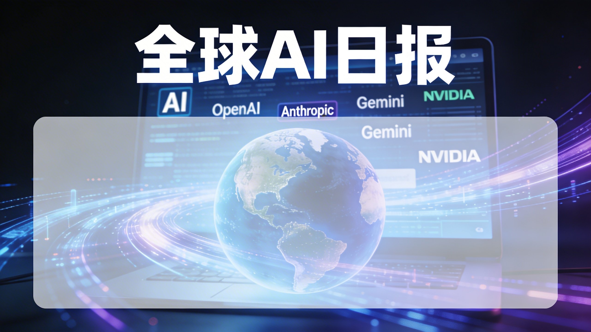

# 全球 AI 日报｜2026-03-10

> 日期：2026-03-10  
> 主题：OpenAI、Anthropic、Google Gemini、NVIDIA、AI 监管与资本动向

## 今日摘要

今天全球 AI 新闻的主线，已经不只是模型参数和能力对比，而是明显进入了 **商业化、政策关系、基础设施、监管治理** 四线并行的竞争阶段。头部玩家的战场正在迅速从“谁更聪明”转向“谁更能进企业、进制度、进基础设施层”。

## 重点一：OpenAI 继续向企业级 AI 总平台推进

今天和 OpenAI 相关的新闻，一边指向企业级竞争持续升级，另一边则暴露出外部法律与社会压力仍在加大。

### 关键信号
- GPT-5.4 继续被放在企业竞争语境下讨论，说明 OpenAI 的核心战场已经是企业市场，而不是单纯的模型演示。
- OpenAI to acquire Promptfoo，释放出其继续补强评测、安全测试、生产可用性能力链路的信号。
- 同时，OpenAI 相关诉讼与社会责任讨论仍在增加，意味着其外部治理压力同步走高。

### 判断
OpenAI 正在从模型公司升级为完整 AI 生产系统提供商。未来能否持续领先，不只取决于模型能力，还取决于企业交付能力、风险控制能力和平台完整度。

## 重点二：Anthropic 与政府/国防体系争议，成为今日核心话题

Anthropic 今天是全球 AI 舆论的焦点之一。多家主流媒体集中报道其与美国政府、国防体系之间围绕“供应链风险/安全标签”的争议。

### 关键信号
- WSJ、NYT、Washington Post、BBC、CNBC、Axios、WIRED 等多家媒体密集报道。
- 争议焦点不再是模型能力，而是政府采购、国家安全标签、供应商信任资格。

### 判断
这代表 AI 行业正式进入制度层竞争。未来头部 AI 公司的命运，可能不仅由技术和市场决定，还会受到政策关系、政府信任与安全审查结果的深刻影响。

## 重点三：Google / Gemini 继续走“生态整合”路线

今天 Gemini 没有出现单点爆炸性新闻，但其相关新闻仍主要围绕产品使用、企业案例和能力铺开。

### 判断
Google 的 AI 战略非常清楚：不只打造一个聊天机器人，而是把 Gemini 深度嵌入搜索、办公、Android、云服务和企业工作流。它更像是在做“AI 基础层渗透”，而不是追求单次舆论爆点。

## 重点四：NVIDIA 从算力公司走向 AI 平台公司

今天 NVIDIA 的相关新闻显示，它正在继续从底层算力扩展到更完整的 AI 平台层。

### 关键信号
- 关于开源 AI Agent 平台的消息，引发广泛关注。
- 大规模 AI 基础设施合作继续推进。

### 判断
NVIDIA 已经不满足于只做芯片供应商，而是在向 AI 运行平台、Agent 生态和企业基础设施入口上探。谁控制平台，谁就不仅拥有算力收入，还会拥有生态影响力。

## 重点五：AI 资本热度仍高，头部项目融资集中度更强

今天还有一条非常醒目的资本线：AI 领域继续出现 10 亿美元级别的超大额融资消息。

### 判断
资本并未撤离 AI，而是在更集中地押注头部项目、基础设施型机会、平台型团队和下一代入口型产品。未来不是所有 AI 创业都能持续获得资金，真正被追逐的将是最像“基础设施”和“下一代平台”的那一批。

## 重点六：监管与责任，正在从讨论走向落地

今天监管相关新闻分布广泛，涉及欧盟 AI 法案、高风险行业责任、军事 AI 外溢等议题。

### 判断
AI 监管已经从“要不要管”走到“怎么具体管”。未来企业需要同时回答：谁承担错误责任、哪些场景必须设限、民用与军用边界如何划定、采购审查由谁主导。

## 今日结论

今天最值得记住的一句话是：

**AI 竞争，正在从模型战升级为体系战。**

接下来的胜负，不只取决于谁的模型更强，还取决于谁更能进入企业流程、占住基础设施、通过监管与安全审查，并形成真正可持续的分发与商业闭环。

## 参考来源

- BBC
- The Wall Street Journal
- The New York Times
- The Washington Post
- CNBC
- Axios
- WIRED
- TechCrunch
- eMarketer
- NVIDIA Blog
- Bloomberg
- Financial Times
